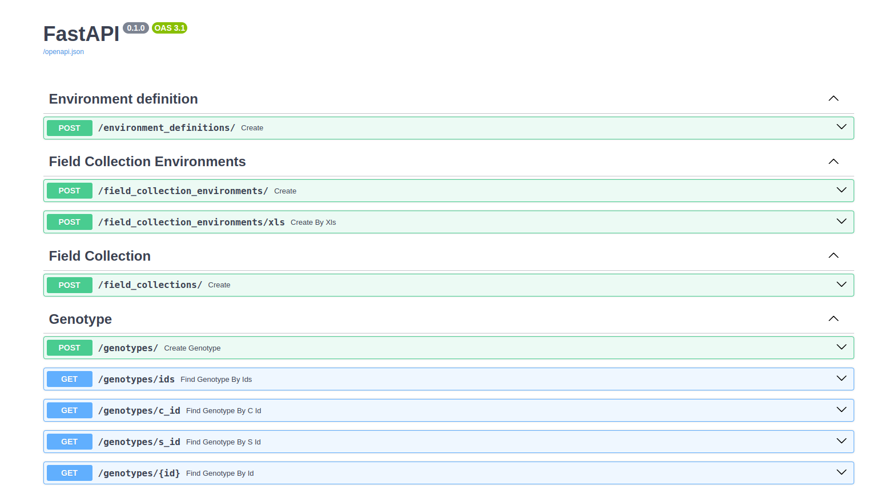

# DataWarehouse for phenotypical data


This repository provides a system for storing phenotypic data collected in field books. The system was built using Docker to facilitate quick installation. Below are the steps for installation.

## Requirements:

### Hardware Requirements: 

The recommended computer for deploying this application should have at least a quad-core processor, 4GB of RAM, and 250GB of hard disk space for initial testing.

These requirements are specifically for the Phen_API_STORE. Additional systems will be installed on the same machine. For experimental and production use, consider upgrading to a system with an eight-core 16-thread processor, 24GB of RAM, and 2.5TB of storage, similar to our current setup.

### Operating System: 

Ubuntu `22.04` is the recommended operating system due to its up-to-date kernel and configurations that are optimized for application deployment. While Windows, macOS, or other systems can be used, they will require installing Docker in a Linux container with x86-64 architecture.

### Software Requirements: 

Docker is the only software required for this project. Please install it from the [official repository](https://www.digitalocean.com/community/tutorials/how-to-install-and-use-docker-on-ubuntu-22-04) to ensure compatibility and proper execution of the following commands.


## Run application

The project utilizes multiple microservices. A Docker network will be created to facilitate inter-service communication.

```shell
docker network create phen-net
```

There are two ways to run this container:

### 1. Using an existing MariaDB database: 
    
If you already have a database set up, you can use it with this container.

Rename the file `example.env` to `.env` put the variables form user, password, host and ip for database and the port to expose the api service:


```
DATABASE_USERNAME=user_to_mariadb
DATABASE_PASSWORD=password_to_mariadb
DATABASE=phenotipyc_db
DATABASE_HOST=host_to_mariadb
DATABASE_PORT=port_to_mariadb
PORT_API=8001
```
**Notes:**
* Ensure all database connection parameters are correctly configured and that network connectivity between the API server and the database server is established.

Command to run the container

```shell
docker compose -f compose.yaml up -d
```


### 2. Creating a new database: 

The container can create a new database and handle all necessary connections for the application to function.

Rename the file `example.env` to `.env` put the variables form user, password, host and ip for database and the port to expose the api service:

```
DATABASE_ROOT_PASSWORD=password_to_root
DATABASE_USERNAME=user_to_mariadb
DATABASE_PASSWORD=password_to_mariadb
DATABASE=name_of_database
DATABASE_STORE_DATA_FOLDER=absolute_path_to_store_data_from_database
PORT_API=8001
```
**Notes:**

* Verify and correctly configure the following database credentials: root password, user, password.
* Verify the absolute path to store the data from Maria database on DATABASE_STORE_DATA_FOLDER


Command to run the container

```shell
docker compose -f compose.db.yaml up -d
```


## Check application running

To confirm the application is running, access the following URL in a web browser:

`http://{the_ip_server}:{port_on_variable_PORT_API}`

For example:

On a local machine with the port set to 8001, the URL would be:

`http://localhost:8001/docs`




## About author


In collaboration with the [Universidad Autonoma del Estado de Mexico](https://www.uaemex.mx/), supported by [CONAHCYT](https://conahcyt.mx/) scholarships and supported by [CIMMYT](https://www.cimmyt.org/es/), this project was created. For new features, changes, or improvements, please reach out to:

Student, Ph.D. Juan Carlos Moreno Sanchez

* **[Scholar email](mailto:jcmorenos001@alumno.uaemex.mx)**
* **[Personal email](mailto:carlos.moreno.phd@gmail.com)**


